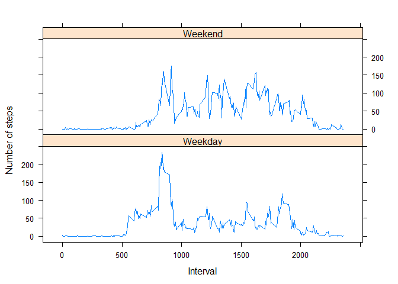

# Reproducible Research: Peer Assessment 1


## Loading and preprocessing the data

```r
#read the data
activity_data <- read.csv("activity.csv")

head(activity_data)
```

```
##   steps       date interval
## 1    NA 2012-10-01        0
## 2    NA 2012-10-01        5
## 3    NA 2012-10-01       10
## 4    NA 2012-10-01       15
## 5    NA 2012-10-01       20
## 6    NA 2012-10-01       25
```

```r
names(activity_data)
```

```
## [1] "steps"    "date"     "interval"
```

```r
activity_data$date <- as.Date(activity_data$date, "%Y-%m-%d")
```

## What is mean total number of steps taken per day?

```r
#Get the Steps per day
steps_per_day <- aggregate(steps ~ date, activity_data,sum,na.rm = TRUE)

#Create Graph
hist(steps_per_day$steps,main="Steps per Day",xlab="Day",col="hotpink")
```

 

```r
#Get the mean
mean(steps_per_day$steps)
```

```
## [1] 10766.19
```

```r
#Get the median
median(steps_per_day$steps)
```

```
## [1] 10765
```

## What is the average daily activity pattern?

```r
#Average Daily Activity Pattern
time_series <- tapply(activity_data$steps, activity_data$interval, mean, na.rm = TRUE)

#Plot requested time series
plot(row.names(time_series), time_series, type = "l", xlab = "5 Minute Interval", 
     ylab = "Average Across All Days", main = "Average Number of Steps", 
     col = "blue")
```

 

```r
#max 5 minute time interval
max_num <- which.max(time_series)
max_num
```

```
## 835 
## 104
```

```r
names(max_num)
```

```
## [1] "835"
```


## Imputing missing values

```r
#Get the missing values
missing_values <- sum(is.na(activity_data))
missing_values
```

```
## [1] 2304
```

```r
#Give missing values a value
average_steps <- aggregate(steps ~ interval, data = activity_data, FUN = mean)
NA_value <- numeric()
for (i in 1:nrow(activity_data)) {
  new_data <- activity_data[i, ]
  if (is.na(new_data$steps)) {
    the_steps <- subset(average_steps, interval == new_data$interval)$steps
  } else {
    the_steps <- new_data$steps
  }
  NA_value <- c(NA_value, the_steps)
}
#Create new dataset with no missing values
upd_activity <- activity_data
upd_activity$steps <- NA_value

#upd_activity

#Make a histogram w/updated data
new_step_total <- aggregate(steps ~ date, data = upd_activity, sum, na.rm = TRUE)

hist(steps_per_day$steps,main="Steps per Day",xlab="Day",col="purple")
```

 

```r
#Get the Mean and Median
mean(new_step_total$steps)
```

```
## [1] 10766.19
```

```r
median(new_step_total$steps)
```

```
## [1] 10766.19
```
## Are there differences in activity patterns between weekdays and weekends?


```r
library("lattice")
get_days <- weekdays(activity_data$date)
days <- vector()
for (i in 1:nrow(activity_data)) {
  if (get_days[i] == "Saturday") {
    days[i] <- "Weekend"
  } else if (get_days[i] == "Sunday") {
    days[i] <- "Weekend"
  } else {
    days[i] <- "Weekday"
  }
}
activity_data$days <- days
activity_data$days <- factor(activity_data$days)

stepsByDay <- aggregate(steps ~ interval + days, data = activity_data, mean)
names(stepsByDay) <- c("interval", "daylevel", "steps")

xyplot(steps ~ interval | daylevel, stepsByDay, type = "l", layout = c(1, 2), 
       xlab = "Interval", ylab = "Number of steps")
```

 
